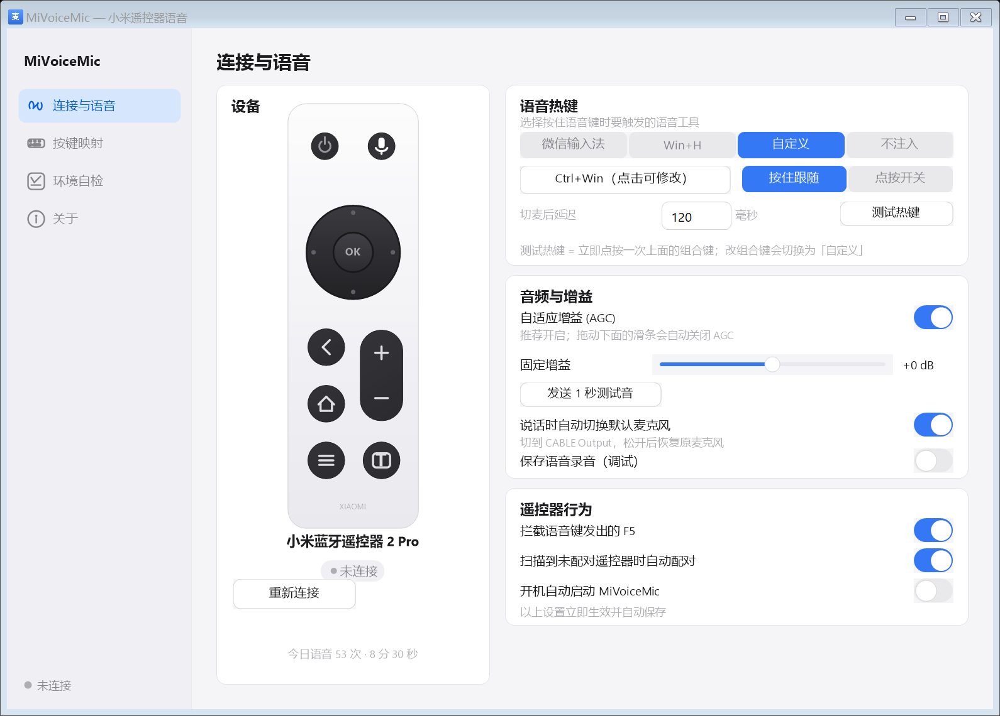
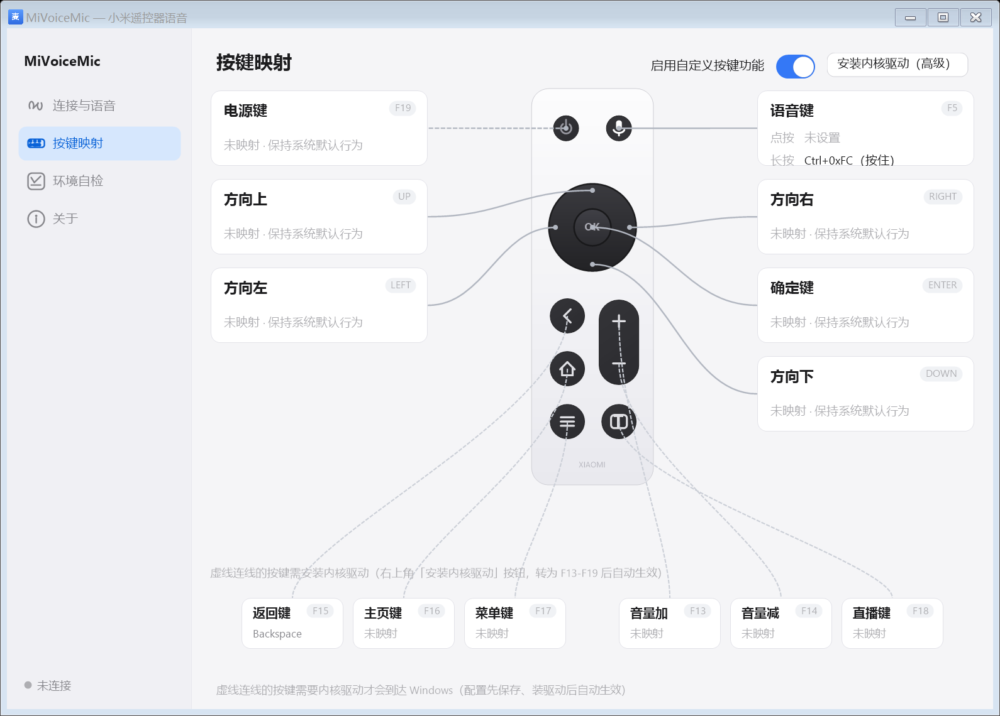
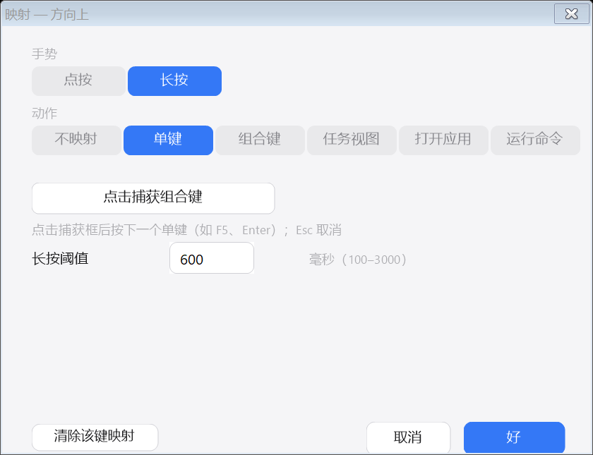

# MiVoiceMic — 小米蓝牙遥控器 2 Pro × Windows 语音输入

把小米蓝牙遥控器 2 Pro（RC003）变成 Windows 的**无线麦克风**：按住遥控器语音键说话，松开即完成输入 —— 配合微信输入法（WeType）语音或 Windows 语音键入（Win+H），在任何输入框（微信、VSCode、浏览器、AI 编程工具……）做 Vibe Coding。

| 连接与语音 | 按键映射 |
|---|---|
|  |  |

参考并致敬 macOS 端 [HD838A/remote-mic-app](https://github.com/HD838A/remote-mic-app)（原版应用，本项目界面与交互的参考）与 Windows 端 [QL-4/RemoteMapper](https://github.com/QL-4/RemoteMapper)（ATVV 协议逆向与内核驱动来源，许可证同为 GPL-3.0）。

## 功能特性

- **语音输入**：按住遥控器语音键 → ATVV 协议经 BLE 推流 → IMA ADPCM 解码（16 kHz）→ 虚拟声卡（VB-CABLE）→ 自动切换默认麦克风 → 注入输入法语音热键 → 松开上屏
- **语音热键**：微信输入法（右 Alt+逗号）/ Windows 语音键入（Win+H）/ 自定义组合键（捕获框直接按键，支持 Win 键），按住跟随或点按开关两种注入方式
- **按键映射**：遥控器按键 → 单键 / 组合键 / 任务视图 / 打开应用 / 运行命令，支持**点按**与**长按**双手势（阈值可调）
- **设置界面**：连接与语音 / 按键映射 / 环境自检 / 关于 四页，所有设置即时生效并自动保存
- **托盘常驻**：关闭窗口即最小化到托盘；托盘菜单可快速切换预设、重连遥控器
- **诊断齐全**：图形化环境自检、`--check` / `--selftest` / `--e2e` / `--sniff` / `--screenshot` 命令行工具

## 环境要求

- Windows 10 1709+ / Windows 11 x64，带蓝牙（BLE）适配器
- 小米蓝牙遥控器 2 Pro（约 ¥99，[官网](https://www.mi.com/xiaomi-bluetooth-remote-2-pro)）
- VB-CABLE 虚拟声卡（免费，见下文安装）
- 微信输入法（可选，也可用 Win+H）

## 首次配置（三步）

### 第 1 步：配对遥控器

1. Windows 设置 → 蓝牙和其他设备 → 添加设备 → 蓝牙
2. **同时长按遥控器的 [主页] 和 [菜单] 键**，直到指示灯快闪进入配对模式
3. 选择名为 **“小米蓝牙语音遥控器”**（或 `MI RC`）的设备完成配对

> 本应用启动后如果没找到已配对的遥控器，也会自动扫描：把遥控器置于配对模式靠近电脑，应用会尝试自动完成配对（失败也没关系，按上面手动配对即可，一次性操作）。

### 第 2 步：安装 VB-CABLE 虚拟声卡

双击 `setup\install-vbcable.cmd`（会从 vb-audio.com 下载官方驱动包并弹出安装器，点 **Install Driver**，提示重启则重启）。或手动去 <https://vb-audio.com/Cable/> 下载安装。

装好后系统会多出一对设备：播放端的 **CABLE Input** 和录音端的 **CABLE Output** —— 前者接收本应用推的语音流，后者伪装成“麦克风”供输入法录音。

### 第 3 步：安装微信输入法（可选）

从 <https://z.weixin.com/qqjm> 下载安装。默认语音快捷键是**右 Alt + 逗号**，本应用内置同名预设；不同版本默认值可能不同（例如 Ctrl+Win）—— 在“连接与语音 → 语音热键”里点击组合键捕获框，直接按下与输入法设置一致的热键即可。

## 使用

双击 `MiVoiceMic.exe`：主窗口（标准 Windows 窗口，可拖动、可调整大小）+ 托盘图标同时出现。连接成功后设备卡显示 **已连接**、电量和充电状态（插上充电线显示「充电中」）：

1. 点一下目标输入框（微信聊天框、VSCode、浏览器地址栏……）
2. **按住遥控器语音键，说话**
3. **松开** —— 文字上屏

关闭主窗口（X）= 最小化到托盘，程序继续在后台工作（首次关闭有气泡提示）；托盘图标右键 → 退出。

### 主窗口四个页面

| 页面 | 内容 |
|---|---|
| **连接与语音** | 设备卡（遥控器渲染图、连接状态、电量、说话电平条、今日使用统计）；语音热键（预设 / 组合键捕获 / 按住-点按模式 / 切麦延迟 / **测试热键**）；音频（AGC、固定增益滑条、**发送 1 秒测试音**、自动切麦、保存录音调试）；遥控器行为（拦截 F5、自动配对、开机自启） |
| **按键映射** | 遥控器矢量图居中，按键卡片按实物位置环绕（电源左上、语音右上、方向与确定依次排开，连线不交叉）；底部一排是需内核驱动的 6 个按键（虚线连线）。点击卡片编辑：**点按 / 长按** 手势 → **单键 / 组合键（捕获框直接按键，支持 Win 键）/ 任务视图 / 打开应用 / 运行命令** 动作。右上开关启用/停用全部映射 |
| **环境自检** | 蓝牙适配器 / 遥控器配对 / VB-CABLE 两端 / 微信输入法 逐项检查（即 `--check` 的图形版） |
| **关于** | 版本、致谢、config/log 快捷方式、运行日志实时尾部 |



### 按键映射与非标准按键

无驱动方案下 Windows 原生识别遥控器的 **6 个键**：语音键(F5)、方向×4、确定(Enter)——这些键在映射页直接配置即可生效。

**返回 / 主页 / 菜单 / 直播 / 电源 / 音量± 这 7 个键**发送的是非标准 HID 用法，Windows 在内核层直接丢弃，任何用户态程序（包括本程序）都收不到。映射页底部仍可对它们做配置（保存于 keymap），其键码对应 RemoteMapper 内核驱动的重映射（F13–F19）：程序已内置该驱动（`driver\` 文件夹），页面上方 **「安装内核驱动（高级）」** 按钮可一键调起安装脚本——需要管理员权限、开启测试签名（Secure Boot 开启的电脑不适用）并重启两次；装好后已保存的映射自动生效，不想用了可一键卸载。

完整的技术分析（HID 用法分析、每种替代路线为何走不通、测试签名与 Secure Boot 的权衡）见 **[docs/NON-STANDARD-KEYS.md](docs/NON-STANDARD-KEYS.md)**。

> ⚠️ 把语音键映射到其他动作后，启用映射期间该键不再触发语音输入（被映射占用）。
> ⚠️ 测试映射请按**遥控器上**的键——物理键盘的同名键会被识别为“非遥控器”而正常放行。

映射引擎通过 **Raw Input 设备归因**（按 HID VID:PID，默认 `2717:32B8`）区分遥控器按键与物理键盘——物理键盘的相同按键不受影响。带长按手势的键在阈值（默认 600ms）前后分别触发点按/长按动作。设备归属不明时（如长时间静置后的第一按）采用**延迟归因**：按下事件先被扣住，抬起事件经 Raw Input 确认真实来源后再触发映射动作或还原原键，因此遥控器按键不会"漏"成原始方向键，物理键盘也不会被误改。

### 托盘菜单

| 菜单项 | 说明 |
|---|---|
| 打开主界面 | 显示主窗口（双击托盘图标同） |
| 状态 / 电量 | 遥控器连接状态、电池电量与充电状态 |
| 语音热键 | 微信输入法 / Win+H / 不注入（快捷切换） |
| 拦截遥控器语音键的 F5 | 连接期间吞掉语音键的 F5 连发（防止刷新页面/触发调试），默认开 |
| 说话时自动切换默认麦克风 | 默认开；关闭后需手动把默认麦克风设为 CABLE Output |
| 重新连接遥控器 | 遥控器休眠唤醒后若没自动恢复，点这个 |
| 退出 | 完全退出程序 |

## 工作原理

```
遥控器(按住语音键) --BLE ATVV--> 本应用
                                ├─ IMA ADPCM 解码 (16 kHz) + 去尖峰/低通/AGC
                                ├─ 推流到虚拟声卡 "CABLE Input" (waveOut)
                                ├─ 把系统默认麦克风临时切到 "CABLE Output" (IPolicyConfig)
                                ├─ 注入微信输入法语音热键 (SendInput, 按住/松开跟随)
                                └─ 低级键盘钩子 + Raw Input 归因：按键映射 / 吞掉语音键的 F5 连发
```

松开语音键后自动释放热键、恢复原默认麦克风。微信输入法在按住期间听到的就是遥控器麦克风的声音——整个过程你不需要坐在电脑前。

## 从源码构建

无需安装任何 SDK——使用系统自带的 .NET Framework 4.8 编译器：

```
build.bat
```

产物为单文件 `MiVoiceMic.exe`（x64，内嵌程序图标）。`build.bat` 还会把 `reference\RemoteMapper\driver\MiRemoteHidFilter` 复制到 `driver\`（内核驱动安装器所需）；克隆仓库后如果 `reference\` 不存在，请先按 [致谢](#致谢与许可) 中的地址获取 RemoteMapper 仓库，或直接使用发行包自带的 `driver\` 文件夹。

## 命令行工具

| 命令 | 用途 |
|---|---|
| `MiVoiceMic.exe --check` | 环境自检：蓝牙适配器、遥控器配对、VB-CABLE、微信输入法 |
| `MiVoiceMic.exe --selftest` | 离线单元测试（解码器/分帧/配置/热键/手势引擎/按键映射/充电状态解析/按键归因/会话恢复/蓝牙超时，89 项） |
| `MiVoiceMic.exe --e2e` | **链路自测（无需遥控器）**：TTS 语音走完整管线——合成语音→CABLE→切换默认麦克风→恢复 |
| `MiVoiceMic.exe --e2e --inject` | 同上，并真实注入微信输入法语音热键（先点一个文本输入框） |
| `MiVoiceMic.exe --sniff 20` | 键盘嗅探 20 秒：确认遥控器各按键到达的虚拟键码 |
| `MiVoiceMic.exe --screenshot all shots` | 把 4 个 UI 页面 + 编辑对话框离屏渲染成 PNG（UI 调试，不启动蓝牙/钩子） |
| `tools\gattprobe.bat <名字> battery watch` | 直连遥控器读电量 `2A19` 与充电状态 `2BED`（BAS v1.1 解码）；`watch` 订阅 20 秒通知，插拔充电线可验证是否实时推送（应用内不支持 notify 时自动按 60 秒轮询） |

**真机联调建议顺序**：`--check` 全 ✓ → `--e2e` 出现 PASS → 启动主程序 → 按住遥控器语音键说话。哪一步失败就能立刻定位是环境问题还是遥控器侧问题。

## 配置（config.json，首次运行自动生成）

| 键 | 默认 | 说明 |
|---|---|---|
| `hotkey.mode` | `hold` | `hold`=跟随语音键按住/松开组合键；`tap`=点按开关 |
| `hotkey.keys` | `RALT,COMMA` | 组合键（键名：RALT/LCTRL/LWIN/H/数字/字母…） |
| `hotkey.preset` | `wetype` | `wetype` / `winh` / `custom` / `none` |
| `switchDefaultMic` | `true` | 说话期间临时切换默认麦克风到 CABLE Output |
| `switchLeadMs` | `120` | 实际切换默认麦克风后、注入热键前的等待；默认麦克风已是 CABLE 时跳过 |
| `agc` | `true` | 自适应增益（推荐开）；关闭时用固定 `gainDb`（-24…24 dB） |
| `blockF5` | `true` | 拦截语音键的 F5（仅连接期间生效） |
| `keymap.enabled` | `false` | 启用按键映射（映射页右上角开关） |
| `keymap.keys[]` | 13 键默认未映射 | 每键 `click`/`hold` 手势：`{kind: combo/taskview/launch/cmd, keys, tap, single, command, ms}` |
| `keymap.matchVidPid` | `["2717:32B8"]` | Raw Input 归因用的遥控器 HID VID:PID |
| `stats` | 空 | 使用统计（今日/累计次数与秒数），每次语音结束自动写入 |
| `dumpAudio` | `false` | 每次语音存一份 wav 到 exe 目录（调试音质用） |
| `deviceNames` | MI RC 等 | 遥控器识别名（也可用 `deviceMacPrefix` 匹配 C0:5D:39 开头的 MAC） |
| `autoPair` | `true` | 扫描到未配对遥控器广播时尝试自动配对 |

## 故障排查

**启动后一直“未找到遥控器”**
遥控器会深度休眠。按一下任意键唤醒；确认已在系统蓝牙设置里配对（`--check` 第 2 项）；距离别太远。仍不行就在系统里删除配对后重新配对。

**连接成功但按语音键没反应 / CAPS 无响应**
遥控器的普通按键和语音使用不同的蓝牙通道，方向键仍有响应也可能同时发生语音传输中断。程序会自动重连并重试握手；重连期间无法启动语音。日志会记录连接超时和释放旧连接各阶段的耗时，用于区分卡在设备查找、通信还是旧连接清理，不能仅凭一次超时认定固件损坏。

微信输入法配置为“按住说话”时，请按住遥控器语音键说话，松开结束。短按可能在输入法启动前就已结束。默认麦克风已是 CABLE 时，程序会跳过重复切换和切麦等待；准备热键期间已松开，会取消本次注入。

**语音条不结束 / 松开后快捷键像一直按着**

程序会在语音开始后 4 秒没有音频、或音频流连续中断 2.5 秒时，释放本次会话的快捷键并自动重连；仍有音频但一直没有结束通知时，单次会话最多持续 5 分钟。蓝牙请求超过 10 秒会取消并重试。重连、退出、修改语音快捷键或关闭热键注入都会结束当前会话。日志中的 `[VOICE]` 记录恢复原因。

录制 Ctrl+Win 等只有修饰键的组合时，按住组合键后松开即可保存。输入法产生的无效键码（如 `0xFC`）会被忽略；配置里含无法识别的键时，会禁用整个快捷键，避免意外只按住 Ctrl。

“自定义”填写的是要发送给输入法的快捷键，必须与微信输入法里的设置一致。点击“测试热键”后有 3 秒倒计时，请切到记事本等文字输入框；程序随后按所选模式测试 2 秒，按住模式会按住再释放。测试按钮不会代替遥控器采集声音。

**按住语音键后微信输入法毫无反应（无语音条）**
首先确认微信输入法的语音快捷键：右键任务栏输入法图标 → 设置 → 语音。不同版本默认值不同（右Alt+逗号 或 Ctrl+Win）。在程序“连接与语音 → 语音热键”里把组合键捕获成与输入法一致即可，或用“测试热键”按钮验证。

**语音识别到的是电脑麦克风的声音 / 没声音**
运行 `--check` 确认 CABLE 两端都在。微信输入法若支持“按应用设置麦克风”，把 `wetype_server.exe` 的麦克风固定为 **CABLE Output** 更稳（设置→隐私→麦克风）。

**识别断断续续**
蓝牙干扰/距离远；或在“连接与语音”里把“切麦后延迟”调大到 250。

**F5 被吞了想临时用**
“连接与语音 → 遥控器行为”取消拦截（遥控器未连接时物理 F5 本就不受影响）。

**`--check` 显示“0 个播放设备 / 无活动录音端点”**
音频端点图异常（常见于长时间不关机 + 远程桌面工具切换后）。两个办法：右键 `setup\fix-audio.cmd` 以管理员身份运行（重启音频服务，无需重启电脑），或直接重启电脑。

**杀毒软件拦截**
个别安全软件会拦截键盘注入/全局钩子：把 MiVoiceMic.exe 加入信任。

## 已知限制

- 无驱动方案下，返回/主页/菜单/直播/电源/音量± 键被 Windows 丢弃（详见 [docs/NON-STANDARD-KEYS.md](docs/NON-STANDARD-KEYS.md)），可用键：语音、方向、确定
- 遥控器固件决定：松开语音键即停止采集，无“持续录音”模式
- 微信输入法按住语音时若当前无输入框焦点，识别结果不会上屏——先点输入框再说话

## 致谢与许可

- [HD838A/remote-mic-app](https://github.com/HD838A/remote-mic-app)（无线麦，macOS，GPL-3.0）
- [QL-4/RemoteMapper](https://github.com/QL-4/RemoteMapper)（Windows 先行实现与 ATVV 协议逆向笔记，GPL-3.0）— 内置内核驱动即其 `MiRemoteHidFilter` 测试签名包
- [nijez/open-voice-bridge](https://github.com/nijez/open-voice-bridge)
- VB-CABLE 为 VB-Audio 的免费产品，版权归其作者

本项目代码以 [GPL-3.0](LICENSE) 发布。非官方项目，与小米公司无关；小米、微信为 respective 商标持有者所有。
